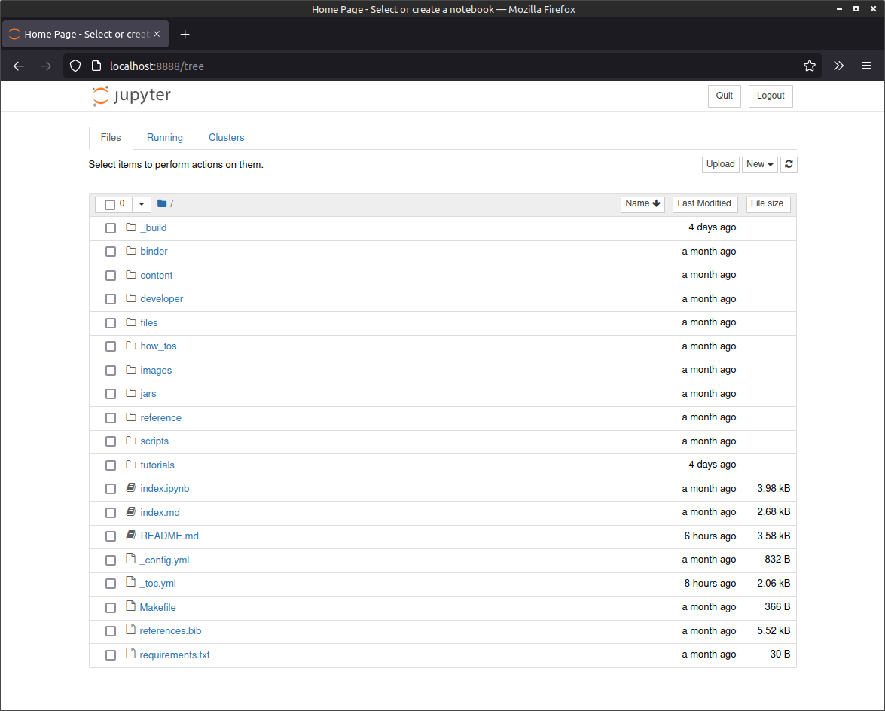
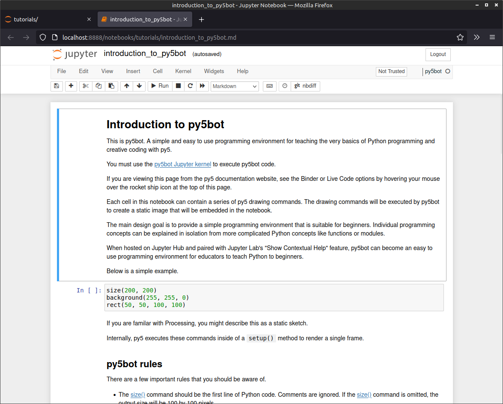
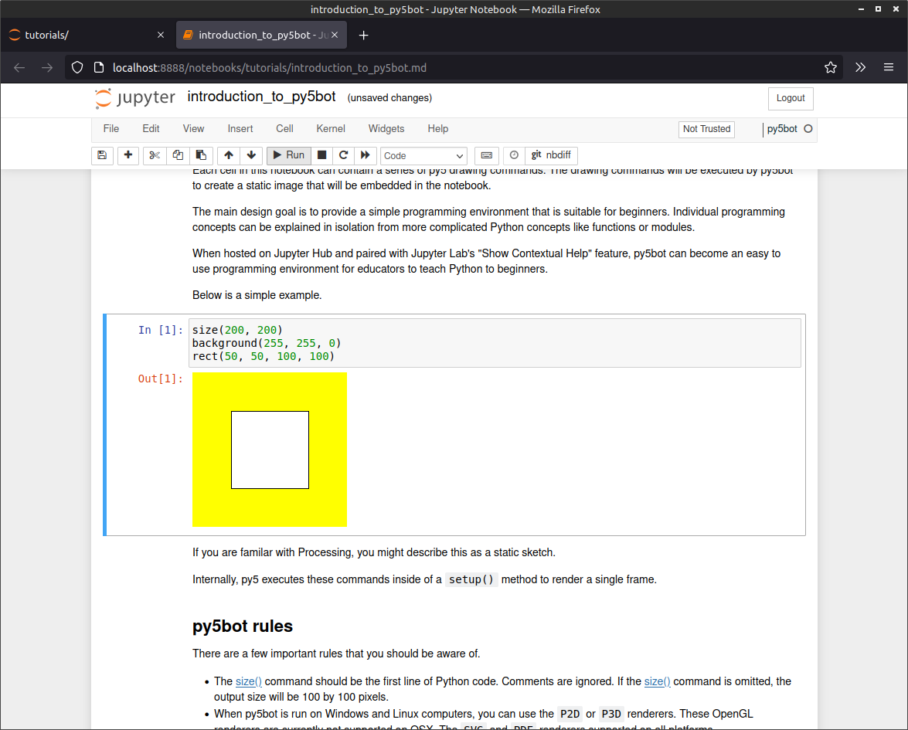
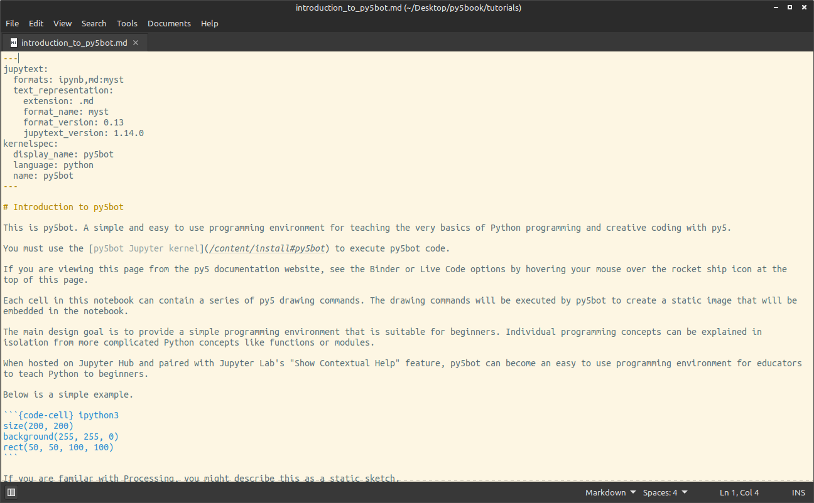

# py5 Documentation

This is the repository for the [py5.ixora.io](https://py5.ixora.io/) website, home to the official documentation, reference, and tutorials for the [py5 project](https://github.com/py5coding/py5generator). 

py5 is a new version of [Processing](https://processing.org/) for Python 3.8+. It makes the Java Processing jars available to the CPython interpreter using [JPype](https://github.com/jpype-project/jpype). It can do just about everything Processing can, except with Python instead of Java code.

The goal of py5 is to create a new version of Processing integrated into the Python ecosystem. Built into the library are thoughtful choices about how py5 can work best with other popular Python libraries and tools such as [Jupyter](https://jupyter.org/), [NumPy](https://numpy.org/), and [Pillow](https://python-pillow.org/).

The documentation website is a work in progress; the reference material is solid, but work is underway to complete the tutorials and add more how-to's. In time, the py5.ixora.io domain may change, and the contents may shift to a [Read the Docs](https://readthedocs.org/) solution that incorporates the content and tools here. 

## Contributing to py5 Documentation

To contribute to the py5 documentation, you should create a Jupyter Notebook environment that includes a working py5 setup (Java 17, Python 3.8+, the relevant Python libraries for py5) and the py5 notebook kernels. You can follow the [installation instructions](https://py5.ixora.io/content/install.html) detailed on the py5 website, which include instructions for [Anaconda](https://www.anaconda.com/). Alternatively, you can follow the steps below, which are less thorough but perhaps more targeted at working on py5 documentation. 

### Set Up Your System and Environment

This is an alternative set of steps (to those linked above) to get you up and running with an environment for working on py5 documentation.

1. First, ensure that you have [Python](https://www.python.org/downloads/) version 3.8 or above installed on your system. 

2. You'll also need Java 17. You may already have this installed on your system; if not, you can download it here: [https://www.oracle.com/java/technologies/javase/jdk17-archive-downloads.html](https://www.oracle.com/java/technologies/javase/jdk17-archive-downloads.html)
   
   There are different ways to install Java. You might use an *Installer* version for macOS or Windows, or a Linux *.deb* or *.rpm* package. Another option is to forgo the installer -- just download the *Archive* for your system and extract it where you like, then open your command prompt or terminal and set the JAVA_HOME environment variable to that location. For example -- assuming you've extracted it to your Windows desktop -- something like:
   ```
   set JAVA_HOME=C:\Users\<user>\Desktop\jdk-17.x.x.x
   ```
   Or, on Linux/macOS:
   ```
   export JAVA_HOME=/home/<user>/Desktop/jdk-17.x.x.x
   ```

3. Open your command prompt / terminal (if you didn't already do so for the previous step) and `cd` to where you'd like to create a directory for your Python virtual environment (I've elected to name this *py5_env*) and enter the following line:
   ```
   python -m venv py5_env
   ```
   Now, activate that environment. On Windows:
   ```
   py5_env\Scripts\activate
   ```
   Or, on Linux/macOS:
   ```
   source py5_env/bin/activate
   ```
   
4. Install the necessary packages using `pip`:
   ```
   pip install jupyter-book jupytext matplotlib numpy py5 py5jupyter
   ```
   As well as the py5 notebook kernels --
   ```
   python -m py5jupyter.kernels.py5.install --sys-prefix
   python -m py5jupyter.kernels.py5bot.install --sys-prefix
   ```

### Starting Jupyter Notebooks

Now that you're set up, you can begin writing py5 documentation. First, use GitHub to create a fork of the [py5book](https://github.com/py5coding/py5book) repo. Then, clone that fork to your computer and create a new branch -- perhaps name it something like *documentation_test*.

In your command prompt / terminal, `cd` to the repo location on your system. If this is a new command prompt / terminal instance, ensure that you set `JAVA_HOME` (if you didn't use the Java installer) and activate your Python virtual environment (that contains the py5 packages). For example, on Windows, something like:
```
set JAVA_HOME=C:\Users\<user>\Desktop\jdk-17.x.x.x
\Users\<user>\Desktop\py5_env\Scripts\activate
```
Now, from inside the repo directory, run:
```
jupyter notebook
```
You can now view a file listing that reflects the contents of your py5book repo branch in your web browser.



### Editing py5 Documentation in Jupyter Notebooks

If you aren't familiar with Jupyter -- it's a web-based environment for writing code in a segmented-like manner, mixing cells containing text and executable code to provide a streamlined, document-centric coding experience. You can run cells one at a time, or all sequentially in one go. [py5 can run in a Jupyter Notebook environment](https://py5.ixora.io/tutorials/jupyter_notebooks.html), and you can use this functionality to write py5 documentation for the py5.ixora.io website.

#### Writing Documentation for Static Sketches

A Processing static sketch doesn't require `setup()` and `draw()` blocks because it doesn't employ animation or interactivity. This means that beginner programmers can jump straight into writing Python code without scaffolding their programs with code they don't yet understand (like, what `def` means, how Python indentation works, and so on).

With `jupyter notebook` running, use your web browser to navigate to the *tutorials* folder; open the *introduction_to_py5bot.md* file.



You'll note that the kernel (top right of the screen) is set to *py5bot*. In short, this kernel operates like Processing's static mode. You can read more about the [py5bot kernel in the documentation](https://py5.ixora.io/tutorials/introduction_to_py5bot.html).

Select the first code cell by clicking on it. Now click the *Run* button to execute the cell contents. As you might expect, this renders a white square (with a black outline) against a yellow background.



#### Handy Jupyter Notebook Shortcuts

Shortcuts will save you a lot of time in Jupyter Notebooks. Try inserting a cell above another using **A**. Note, you'll need to select a cell by clicking to the left of its contents to avoid editing them. Change your new cell between code and markdown using **Y** and **M**, respectively. Markdown cells render as formatted text when you run them; **Shift + Enter** is the shortcut to run a cell.

There are many more shortcuts you can generally find listed next to items in the Jupyter Notebook menus.

#### MyST Markdown

The py5 documentation system uses Jupyter's [MyST Markdown](https://jupyterbook.org/en/stable/content/myst.html) for two-way conversion between .ipynb and text/.md files. The [Jupytext](https://jupytext.readthedocs.io/en/latest/) plug-in (which you'll have already installed with `pip`) lets you author MyST markdown within the Jupyter Notebooks environment. Select *File > Jupytext* and note how the notebook is paired with ipnyb and MyST markdown formats. 


This means that each time you save, Jupyter will write to both formats. If you open the *introduction_to_py5bot.md* file in a text editor, you'll see that it looks a lot like 'vanilla' markdown with a few embellishments -- perhaps most immediately noticeable is the metadata at the top of the file.



For more information on MyST Markdown, refer to the [Jupyter Book documentation](https://jupyterbook.org/en/stable/content/index.html).

## Adding New Pages and Sections

You create new notebooks through the Jupyter Notebook web interface. Of course, you'll need to select the kernel you intend to use (i.e. py5bot for static sketches) and use the **File > Jupytext** menu to check both ipynb and MyST formats. 

However, your notebooks won't automatically appear when you build the py5book documentation. To add or shuffle pages and sections, edit the *_toc.yml* file. You'll find working with this quite self-explanatory. For example, the *Getting Started* section looks like this:
```
...
- caption: Getting Started
  chapters:
  - file: content/install
  - file: content/osx_users
  - file: content/py5_modes
...
```

## Building Documentation

For Linux/macOS users, there's a Makefile in the root of the py5book repo. If you cannot run the Makefile (on Windows), you can read it to see how you run the commands 'manually' -- **build** is:
```
jb build .
python scripts/post_build.py
```
And **clean** is:
 ```
jb clean .
```
The build outputs to a directory named *_build*. 

## Get In Touch

Have a comment or question? We'd love to hear from you! The best ways to reach out are:

* GitHub [discussions](https://github.com/py5coding/py5generator/discussions) and [issues](https://github.com/py5coding/py5generator/issues)
* Twitter [@py5coding](https://twitter.com/py5coding)
* [Processing Foundation Discourse (forum)](https://discourse.processing.org/)

